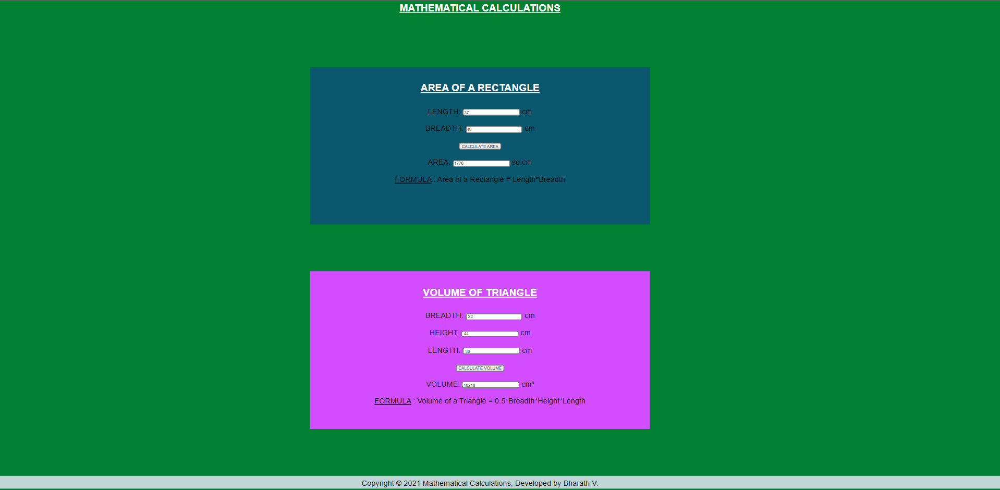

# Web Page for Mathematical Calculations

## AIM:

To design a static website with validation to perform mathematical calculations in client side.

## DESIGN STEPS:

### Step 1:

Requirement collection.

### Step 2:

Creating the layout using HTML and CSS.

### Step 3:

Write javascript to perform the calculations.

### Step 4:

Include regularexpression based input validation.

### Step 5:

Validate the layout in various browsers.

### Step 6:

Validate the HTML code.

### Step 6:

Publish the website in the given URL.

## PROGRAM :
```
<!DOCTYPE html>
<html lang="en">
  <head>
    <meta charset="UTF-8" />
    <meta http-equiv="X-UA-Compatible" content="IE=edge" />
    <meta name="viewport" content="width=device-width, initial-scale=1.0" />
    <title>Mathematical Calculations</title>
    <style>
    * {
      box-sizing: border-box;
      font-family: Arial, Helvetica, sans-serif;
    }
    body {
      background-color:#002080;
    }
    .container {
      width: 1080px;
      margin-left: auto;
      margin-right: auto;
    }
    .content {
      display: block;
      width: 100%;
      background-color:#00bfff;
      min-height: 500px;
      margin-top: 150px;
      margin-bottom: 150px;
    }
    .content2{
      display: block;
      width: 100%;
      background-color:#d24dff;
      min-height: 500px;
      margin-top: 150px;
      margin-bottom: 150px;
    }
    h1{
      text-align: center;
      font-size:XX-large;
      padding-top: 50px;
      padding-bottom: 20px;
      color: rgb(255, 255, 255);
    }
    .formelement{
      text-align: center;
      font-size:X-large;
      margin-top: 5px;
      margin-bottom: 5px;
    }
    .footer{
      text-align: center;
      font-size:X-large;
      width: 100%;
      height: 40px;
      background-color: #c0d5d6;
      text-align: center;
      padding-top: 10px;
      margin: 0px 0px 0px 0px;
      color: #000000;
    }
    </style>
  </head>
  <body>
    <h1><u>MATHEMATICAL CALCULATIONS</u></h1>
    <div class="container">
      <div class="content">
          <h1><u>AREA OF A RECTANGLE</u></h1>
          <form>
              <div class=formelement>
                  <label for="aedit">LENGTH:</label>
                  <input type="text" id="aedit" value=""/>
                  <label for="aedit">cm</label>
              </div><br>
              <div class=formelement>
                  <label for="bedit">BREADTH:</label>
                  <input type="text" id="bedit" value=""/>
                  <label for="bedit">cm</label>
              </div><br>
              <div class=formelement>
                  <input type="button" value="CALCULATE AREA" id="xbutton"/>
              </div><br>
              <div class=formelement>
                  <label for="cedit">AREA:</label>
                  <input type="text" id="cedit" readonly=""/>
                  <label for="cedit">sq.cm</label>
              </div><br>
              <div class=formelement>
                <u>FORMULA</u> : Area of a Rectangle = Length*Breadth
              </div>
          </form>
      </div>
      <script type="text/javascript">
          var button;
          button=document.querySelector("#xbutton");
          button.addEventListener("click",function()
          {
          var atext,btext,ctext;
          var aval,bval,cval;
          atext=document.querySelector("#aedit");
          btext=document.querySelector("#bedit");
          ctext=document.querySelector("#cedit");

              aval=parseInt(atext.value);
              bval=parseInt(btext.value);
              cval=aval*bval;
              ctext.value=""+cval;
              res=ctext.value;
              if (res=="NaN")
              {
                alert("Please Enter Integers");
              }
          });
      </script>
      <div class="content2">
          <h1><u>VOLUME OF TRIANGLE</u></h1>
          <form>
              <div class="formelement">
                <lable for="ledit">BREADTH:</lable>
                <input type="text" id="ledit" value=" "/>
                <label for="ledit">cm</label>
              </div><br>
              <div class="formelement">
                <lable for="medit">HEIGHT:</lable>
                <input type="text" id="medit" value=" "/>
                <label for="medit">cm</label>
              </div><br>
              <div class="formelement">
                <lable for="nedit">LENGTH:</lable>
                <input type="text" id="nedit" value=" "/>
                <label for="nedit">cm</label>
              </div><br>
              <div class="formelement">
                <input type="button" value="CALCULATE VOLUME" id="ybutton"/>
              </div><br>
              <div class="formelement">
                <lable for="oedit">VOLUME:</lable>
                <input type="text" id="oedit" readonly=""/>
                <label for="oedit">cm³</label>
              </div><br>
              <div class="formelement">
              <u>FORMULA</u> : Volume of a Triangle = 0.5*Breadth*Height*Length
              </div><br>
              
          </form>
  
          </div>
      </div>
      <script type="text/javascript">
        var button;
        button=document.querySelector("#ybutton");
        button.addEventListener("click",function()
           {
            var ltext,mtext,ntext,otext;
            var lval,mval,nval,oval;
  
            ltext=document.querySelector("#ledit");
            mtext=document.querySelector("#medit");
            ntext=document.querySelector("#nedit");
            otext=document.querySelector("#oedit");
    
            lval=parseInt(ltext.value);
            mval=parseInt(mtext.value);
            nval=parseInt(ntext.value);
            oval=0.5*lval*mval*nval;
            otext.value=""+oval;
            res1=otext.value
            if (res1=="NaN")
            {
              alert("Please Enter Integers");
            }
          });
      </script> 
    <div class="footer">
      Copyright &#169; 2021 Mathematical Calculations, Developed by Bharath V.
    </div>     
  </body>
</html>
```

## OUTPUT:



## Result:

Thus a website is designed to perform mathematical calculations in the client side.
